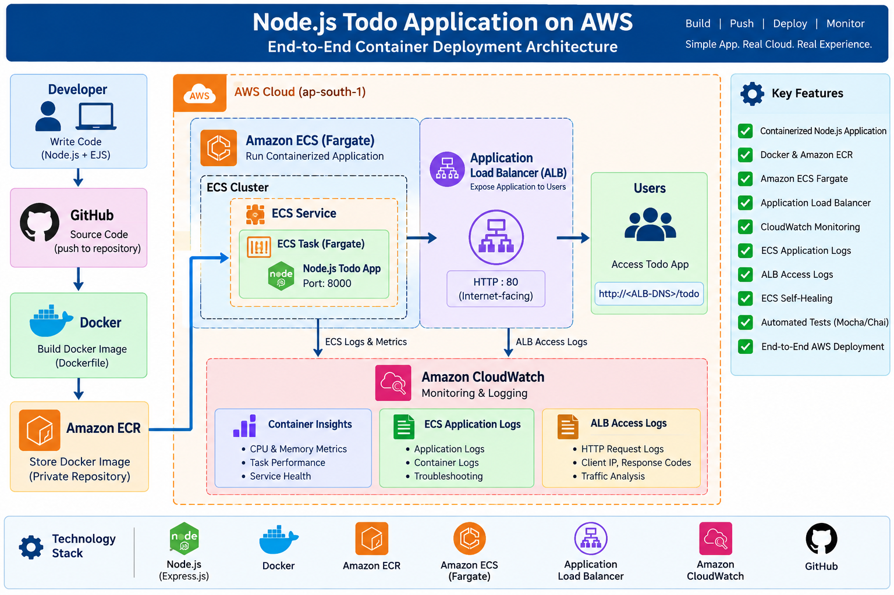

# 🚀 Node.js Todo Application on AWS

A containerized Node.js Todo application deployed on AWS using Docker, Amazon ECR, Amazon ECS Fargate, Application Load Balancer and Amazon CloudWatch.

## 📌 Project Overview

This project demonstrates an end-to-end container deployment on AWS.

The application is packaged as a Docker image, stored in Amazon ECR, deployed on ECS Fargate and exposed to users through an Application Load Balancer.

Monitoring and logging are implemented using Amazon CloudWatch.

## 🏗️ Architecture




### Architecture Flow

```text
Developer
    |
    v
GitHub
    |
    v
Docker Image
    |
    v
Amazon ECR
    |
    v
Amazon ECS Fargate
    |
    v
Application Load Balancer
    |
    v
End User

Monitoring:
ECS → CloudWatch Container Insights
ECS → CloudWatch Application Logs
ALB → CloudWatch Access Logs
🛠️ Technologies
Category	Technologies
Application	Node.js, Express.js, EJS
Container	Docker
Container Registry	Amazon ECR
Compute	Amazon ECS Fargate
Load Balancing	Application Load Balancer
Monitoring	Amazon CloudWatch
Logging	CloudWatch Logs, ALB Access Logs
Source Control	Git, GitHub
Testing	Mocha, Chai, Supertest
💻 Application

The application is a simple Todo application supporting:

Add Todo
Edit Todo
Delete Todo

Application endpoint:

/todo

Application port:

8000

Application Screenshot

🐳 Docker

Build the image:

docker build -t node-todo-aws-devops:1.0 .

Run locally:

docker run -d --name node-todo-local -p 8000:8000 node-todo-aws-devops:1.0

Open:

http://localhost:8000/todo
📦 Amazon ECR

The Docker image is stored in Amazon ECR.

🚀 Amazon ECS Fargate

The containerized application is deployed using Amazon ECS Fargate.

ECS Service

The ECS service maintains the desired number of running tasks.

Task Definition

The ECS task definition specifies the container image, Fargate configuration and application port.

⚖️ Application Load Balancer

The application is exposed through an internet-facing Application Load Balancer.

Target Group

The target group forwards traffic to the ECS container on port 8000.

The health check endpoint is:

/todo

📊 Monitoring

Amazon CloudWatch is used to monitor the ECS workload and application.

ECS Metrics

CloudWatch metrics include CPU and memory utilization and container-level performance information.

ECS Application Logs

ALB Access Logs

🔄 ECS Self-Healing

The ECS service was tested by manually stopping a running task.

ECS detected that the running task count was below the desired count and automatically launched a replacement task.

This validated ECS service self-healing behavior.

🧪 Testing

Automated application tests are implemented using Mocha, Chai and Supertest.

Run:

npm test

Expected result:

2 passing
🔧 Troubleshooting
ALB HTTPS Timeout

The ALB listener was configured for HTTP port 80.

Testing the application with HTTPS resulted in a connection timeout.

The application was successfully accessed using:

http://<ALB-DNS>/todo
ECS Task Replacement

A running ECS task was manually stopped.

ECS automatically launched a replacement task to maintain the desired service count.

ALB Access Logs

ALB access logs initially did not appear immediately.

After generating traffic through the ALB and allowing time for log delivery, the access logs appeared in CloudWatch.

Docker Engine Connection Error

The local Docker build initially failed because the Docker Desktop Linux engine was not running.

Docker Desktop was started and the image was successfully rebuilt.

📁 Repository Structure
node-todo-aws-devops/
│
├── app.js
├── package.json
├── package-lock.json
├── Dockerfile
├── .dockerignore
├── .gitignore
├── README.md
│
├── views/
│   ├── todo.ejs
│   └── edititem.ejs
│
├── tests/
│   └── app.test.js
│
└── docs/
    ├── architecture.md
    ├── application.png
    ├── ecr.png
    ├── ecs-cluster.png
    ├── ecs-service.png
    ├── task-definition.png
    ├── alb.png
    ├── target-group.png
    ├── ecs-metrics.png
    ├── cloudwatch-ecs-logs.png
    └── cloudwatch-alb-logs.png
📈 Current Status
✅ Node.js application
✅ Docker containerization
✅ Amazon ECR
✅ Amazon ECS Fargate
✅ Application Load Balancer
✅ Target group health checks
✅ CloudWatch Container Insights
✅ ECS application logging
✅ ALB access logging
✅ ECS self-healing validation
✅ Automated tests
✅ GitHub documentation
🔮 Future Enhancements
ECS Service Auto Scaling
HTTPS using AWS Certificate Manager
Terraform Infrastructure as Code
CI/CD pipeline
Jenkins integration
Production-grade security configuration
Secrets management

